# Java Collections Framework Overview

The Java Collections Framework (JCF) is the standard set of interfaces, classes, and algorithms used to store, organize, search, sort, and process groups of objects in Java.

It gives you ready-made data structures such as `ArrayList`, `HashSet`, `PriorityQueue`, and `HashMap` so you do not need to implement common storage logic manually.

## Why Collections Exist

Arrays are simple and fast, but they have important limitations:

- Fixed size after creation.
- Store elements by index only.
- Provide very few built-in operations.
- Cannot directly represent structures like unique sets, queues, sorted maps, or key-value mappings.

Collections solve these problems by providing:

- Dynamic resizing.
- Reusable interfaces and implementations.
- Standard traversal using `Iterator`, enhanced `for`, streams, and spliterators.
- Built-in algorithms through `Collections` and `Arrays`.
- Specialized structures for ordering, uniqueness, sorting, priority, and concurrency.

## Big Picture

The framework is centered around two major hierarchies:

- `Collection`: represents a group of individual elements.
- `Map`: represents key-value pairs and does not extend `Collection`.

`Collection` is the root interface for `List`, `Set`, `Queue`, and `Deque`. `Map` is separate because its basic unit is an entry containing a key and a value, not a single element.

In Java 21 and later, the framework also includes sequenced interfaces:

- `SequencedCollection`: a collection with a defined encounter order and first/last/reversed operations.
- `SequencedSet`: a set that also has a defined encounter order.
- `SequencedMap`: a map with a defined encounter order for entries.

## Interface And Implementation Flowchart

```mermaid
flowchart TD
    Iterable["Iterable<E>"]
    Collection["Collection<E>"]
    SequencedCollection["SequencedCollection<E><br/>defined encounter order, Java 21+"]

    Iterable --> Collection
    Collection --> SequencedCollection

    SequencedCollection --> List["List<E><br/>ordered, indexed, duplicates allowed"]
    Collection --> Set["Set<E><br/>unique elements"]
    Collection --> Queue["Queue<E><br/>elements waiting to be processed"]

    SequencedCollection --> Deque["Deque<E><br/>double-ended queue"]
    Queue --> Deque

    List --> ArrayList["ArrayList<br/>resizable array"]
    List --> LinkedListList["LinkedList<br/>doubly-linked list"]
    List --> Vector["Vector<br/>legacy synchronized list"]
    Vector --> Stack["Stack<br/>legacy LIFO stack"]
    List --> CopyOnWriteArrayList["CopyOnWriteArrayList<br/>thread-safe read-heavy list"]

    Set --> HashSet["HashSet<br/>hash table, no order"]
    Set --> SequencedSet["SequencedSet<E><br/>unique with encounter order, Java 21+"]
    SequencedCollection --> SequencedSet
    SequencedSet --> LinkedHashSet["LinkedHashSet<br/>insertion order"]
    SequencedSet --> SortedSet["SortedSet<E><br/>sorted unique elements"]
    SortedSet --> NavigableSet["NavigableSet<E><br/>search nearest elements"]
    NavigableSet --> TreeSet["TreeSet<br/>red-black tree"]
    Set --> EnumSet["EnumSet<br/>optimized for enum keys"]
    Set --> CopyOnWriteArraySet["CopyOnWriteArraySet<br/>thread-safe read-heavy set"]

    Queue --> PriorityQueue["PriorityQueue<br/>priority heap"]
    Deque --> ArrayDeque["ArrayDeque<br/>resizable array deque"]
    Deque --> LinkedListDeque["LinkedList<br/>deque implementation"]
    Queue --> BlockingQueue["BlockingQueue<E><br/>thread coordination queue"]
    BlockingQueue --> ArrayBlockingQueue["ArrayBlockingQueue"]
    BlockingQueue --> LinkedBlockingQueue["LinkedBlockingQueue"]
    BlockingQueue --> PriorityBlockingQueue["PriorityBlockingQueue"]

    Map["Map<K,V><br/>key-value pairs"]
    SequencedMap["SequencedMap<K,V><br/>ordered entries, Java 21+"]
    Map --> HashMap["HashMap<br/>hash table, no order"]
    Map --> SequencedMap
    SequencedMap --> LinkedHashMap["LinkedHashMap<br/>insertion/access order"]
    SequencedMap --> SortedMap["SortedMap<K,V><br/>sorted keys"]
    SortedMap --> NavigableMap["NavigableMap<K,V><br/>nearest-key operations"]
    NavigableMap --> TreeMap["TreeMap<br/>red-black tree"]
    Map --> Hashtable["Hashtable<br/>legacy synchronized map"]
    Map --> ConcurrentHashMap["ConcurrentHashMap<br/>thread-safe high concurrency"]
    Map --> WeakHashMap["WeakHashMap<br/>weak keys"]
    Map --> IdentityHashMap["IdentityHashMap<br/>compares keys using =="]
    Map --> EnumMap["EnumMap<br/>optimized for enum keys"]
```



## Core Interfaces

| Interface | Purpose | Key Properties | Common Implementations |
|---|---|---|---|
| `Iterable<E>` | Root for enhanced `for` loop support | Provides `iterator()` | Most collection classes |
| `Collection<E>` | Root for groups of elements | Add, remove, size, contains, iterate | `ArrayList`, `HashSet`, `PriorityQueue` |
| `SequencedCollection<E>` | Ordered collection abstraction | First, last, and reversed view operations | `ArrayList`, `LinkedList`, `ArrayDeque`, `TreeSet` |
| `List<E>` | Ordered sequence | Allows duplicates, index access | `ArrayList`, `LinkedList`, `Vector` |
| `Set<E>` | Unique elements | No duplicates | `HashSet`, `LinkedHashSet`, `TreeSet` |
| `SequencedSet<E>` | Unique elements with encounter order | Set semantics plus reversed view | `LinkedHashSet`, `TreeSet` |
| `SortedSet<E>` | Sorted unique elements | Natural order or `Comparator` | `TreeSet` |
| `NavigableSet<E>` | Sorted set with navigation | `lower`, `floor`, `ceiling`, `higher` | `TreeSet` |
| `Queue<E>` | Processing order | Usually FIFO, but not always | `PriorityQueue`, `LinkedList` |
| `Deque<E>` | Double-ended queue | Add/remove at both ends | `ArrayDeque`, `LinkedList` |
| `Map<K,V>` | Key-value mapping | Unique keys, values may duplicate | `HashMap`, `TreeMap`, `ConcurrentHashMap` |
| `SequencedMap<K,V>` | Map with defined entry encounter order | First entry, last entry, reversed view | `LinkedHashMap`, `TreeMap` |
| `SortedMap<K,V>` | Sorted key-value mapping | Keys sorted | `TreeMap` |
| `NavigableMap<K,V>` | Sorted map with navigation | Nearest-key operations | `TreeMap` |

## Sequenced Collections In Java 21+

Before Java 21, several collections had a known order, but there was no common interface for first element, last element, and reverse-order access across lists, deques, linked sets, and sorted sets.

Java 21 introduced:

- `SequencedCollection<E>`
- `SequencedSet<E>`
- `SequencedMap<K,V>`

Important methods:

```java
sequencedCollection.getFirst();
sequencedCollection.getLast();
sequencedCollection.removeFirst();
sequencedCollection.removeLast();
sequencedCollection.reversed();

sequencedMap.firstEntry();
sequencedMap.lastEntry();
sequencedMap.pollFirstEntry();
sequencedMap.pollLastEntry();
sequencedMap.reversed();
```

Examples:

```java
SequencedCollection<String> names = new ArrayList<>(List.of("A", "B", "C"));
System.out.println(names.getFirst());       // A
System.out.println(names.getLast());        // C
System.out.println(names.reversed());       // [C, B, A]

SequencedMap<Integer, String> map = new LinkedHashMap<>();
map.put(1, "A");
map.put(2, "B");
System.out.println(map.firstEntry());       // 1=A
System.out.println(map.reversed().keySet()); // [2, 1]
```

Interview note:

- `List` and `Deque` are sequenced collections in Java 21+.
- `LinkedHashSet`, `TreeSet`, and other sorted/navigable sets are sequenced sets.
- `LinkedHashMap` and `TreeMap` are sequenced maps.
- `HashSet` and `HashMap` are not sequenced because they do not define encounter order.

## Collection vs Collections

`Collection` is an interface.

```java
Collection<String> names = new ArrayList<>();
```

`Collections` is a utility class with static helper methods.

```java
Collections.sort(list);
Collections.reverse(list);
Collections.unmodifiableList(list);
Collections.synchronizedList(list);
```

## List

A `List` is an ordered collection that allows duplicates and supports index-based access.

Use a `List` when:

- Order matters.
- Duplicate values are allowed.
- You need access by position.
- You often process elements sequentially.

### ArrayList

`ArrayList` is backed by a resizable array.

Strengths:

- Fast random access: `get(index)` is O(1).
- Good cache locality.
- Usually the default choice for a general-purpose list.

Weaknesses:

- Insertions or removals in the middle require shifting elements: O(n).
- Resizing creates a larger array and copies existing elements.
- Not synchronized.

Best use:

- Read-heavy lists.
- Appending at the end.
- Accessing by index.

```java
List<String> names = new ArrayList<>();
names.add("Amit");
names.add("Priya");
System.out.println(names.get(0));
```

### LinkedList

`LinkedList` is a doubly-linked list. Each node stores a value plus links to the previous and next nodes.

Strengths:

- Efficient insertion or deletion when you already have the node position.
- Implements both `List` and `Deque`.

Weaknesses:

- Slow random access: `get(index)` is O(n).
- More memory overhead because each node stores extra references.
- Usually slower than `ArrayList` for normal iteration due to poor cache locality.

Best use:

- Queue/deque behavior when `ArrayDeque` is not suitable.
- Frequent insertions/removals through an iterator.

### Vector And Stack

`Vector` is a legacy synchronized list. `Stack` extends `Vector` and is also legacy.

Prefer:

- `ArrayList` for normal list work.
- `ArrayDeque` for stack behavior.
- `CopyOnWriteArrayList` or other concurrent collections for modern thread-safe use cases.

```java
Deque<Integer> stack = new ArrayDeque<>();
stack.push(10);
stack.push(20);
System.out.println(stack.pop());
```

## Set

A `Set` stores unique elements. It uses `equals()` to decide logical equality, and hash-based sets also use `hashCode()`.

Use a `Set` when:

- Duplicates must be prevented.
- You need fast membership checks.
- You care more about uniqueness than index position.

### HashSet

`HashSet` is backed by a `HashMap`. Elements are stored as keys internally.

Strengths:

- Average O(1) add, remove, and contains.
- Allows one `null` element.

Weaknesses:

- Does not guarantee iteration order.
- Requires correct `equals()` and `hashCode()`.
- Performance can degrade with poor hash distribution.

Best use:

- Fast uniqueness checks.
- Removing duplicates where order does not matter.

```java
Set<String> uniqueNames = new HashSet<>();
uniqueNames.add("Amit");
uniqueNames.add("Amit");
System.out.println(uniqueNames.size()); // 1
```

### LinkedHashSet

`LinkedHashSet` is like `HashSet`, but it maintains insertion order.

Best use:

- Removing duplicates while preserving original order.

```java
Set<Integer> numbers = new LinkedHashSet<>(List.of(3, 1, 3, 2));
System.out.println(numbers); // [3, 1, 2]
```

### TreeSet

`TreeSet` is backed by a red-black tree and keeps elements sorted.

Strengths:

- Sorted iteration.
- O(log n) add, remove, and contains.
- Navigation methods such as `floor`, `ceiling`, `lower`, and `higher`.

Weaknesses:

- Slower than `HashSet` for basic lookups.
- Elements must be mutually comparable or you must provide a `Comparator`.
- Does not allow `null` in modern Java when natural ordering is used.

Best use:

- Unique sorted data.
- Range queries.
- Nearest-value lookups.

```java
NavigableSet<Integer> scores = new TreeSet<>(List.of(70, 90, 80));
System.out.println(scores.ceiling(75)); // 80
```

## Queue

A `Queue` stores elements waiting to be processed.

Important method pairs:

| Operation | Throws Exception | Returns Special Value |
|---|---|---|
| Insert | `add(e)` | `offer(e)` |
| Remove head | `remove()` | `poll()` |
| Examine head | `element()` | `peek()` |

Prefer `offer`, `poll`, and `peek` when failure is a normal possibility.

### PriorityQueue

`PriorityQueue` is backed by a binary heap. It removes elements according to priority, not insertion order.

Strengths:

- O(log n) insert and remove.
- O(1) peek at the highest-priority element according to ordering.

Weaknesses:

- Iteration does not return sorted order.
- Does not allow `null`.
- Not thread-safe.

Best use:

- Scheduling.
- Top-k problems.
- Dijkstra-like algorithms.
- Processing tasks by priority.

```java
Queue<Integer> minHeap = new PriorityQueue<>();
minHeap.offer(30);
minHeap.offer(10);
minHeap.offer(20);
System.out.println(minHeap.poll()); // 10
```

For max-heap behavior:

```java
Queue<Integer> maxHeap = new PriorityQueue<>(Comparator.reverseOrder());
```

## Deque

A `Deque` is a double-ended queue. It can work as both a queue and a stack.

Use `ArrayDeque` instead of `Stack` for stack behavior and instead of `LinkedList` for most queue/deque behavior.

### ArrayDeque

`ArrayDeque` is backed by a resizable circular array.

Strengths:

- Fast insertion/removal at both ends.
- No node overhead.
- Usually faster than `LinkedList`.

Weaknesses:

- Does not allow `null`.
- Not thread-safe.

Best use:

- Stack.
- Queue.
- Sliding window algorithms.
- BFS traversal.

```java
Deque<String> queue = new ArrayDeque<>();
queue.offerLast("first");
queue.offerLast("second");
System.out.println(queue.pollFirst());
```

## Map

A `Map` stores key-value pairs. Keys are unique. Values can be duplicated.

Use a `Map` when:

- You need lookup by key.
- You need to count frequency.
- You need to group or associate data.
- You need dictionary-like behavior.

Important views:

```java
map.keySet();      // Set<K>
map.values();      // Collection<V>
map.entrySet();    // Set<Map.Entry<K,V>>
```

When iterating key-value pairs, prefer `entrySet()`:

```java
for (Map.Entry<String, Integer> entry : scores.entrySet()) {
    System.out.println(entry.getKey() + " = " + entry.getValue());
}
```

### HashMap

`HashMap` is the most common general-purpose map.

Strengths:

- Average O(1) get, put, remove, and containsKey.
- Allows one `null` key and multiple `null` values.
- Usually the default choice for key-value lookup.

Weaknesses:

- Does not guarantee order.
- Not synchronized.
- Requires stable and correct key equality.

Important internals:

- Uses an array of buckets.
- Uses `hashCode()` to choose a bucket.
- Uses `equals()` to find the exact key inside that bucket.
- Collisions are stored in bucket chains or tree bins.
- Since Java 8, heavily-collided buckets can become balanced trees when thresholds are met.

```java
Map<String, Integer> frequency = new HashMap<>();
frequency.put("java", frequency.getOrDefault("java", 0) + 1);
```

Better:

```java
frequency.merge("java", 1, Integer::sum);
```

### LinkedHashMap

`LinkedHashMap` maintains predictable iteration order.

Two modes:

- Insertion order: default.
- Access order: useful for LRU caches.

```java
Map<Integer, String> map = new LinkedHashMap<>();
map.put(2, "B");
map.put(1, "A");
System.out.println(map.keySet()); // [2, 1]
```

Simple LRU cache pattern:

```java
Map<Integer, String> cache = new LinkedHashMap<>(16, 0.75f, true) {
    @Override
    protected boolean removeEldestEntry(Map.Entry<Integer, String> eldest) {
        return size() > 100;
    }
};
```

### TreeMap

`TreeMap` is a sorted map backed by a red-black tree.

Strengths:

- Keys are sorted.
- O(log n) get, put, remove.
- Supports range and navigation operations.

Weaknesses:

- Slower than `HashMap` for simple lookup.
- Keys must be comparable or use a `Comparator`.
- Does not allow `null` keys when natural ordering is used.

Best use:

- Sorted dictionaries.
- Range queries.
- Nearest-key lookups.

```java
NavigableMap<Integer, String> ranks = new TreeMap<>();
ranks.put(10, "ten");
ranks.put(20, "twenty");
System.out.println(ranks.floorKey(15)); // 10
```

### Hashtable

`Hashtable` is a legacy synchronized map.

Prefer:

- `HashMap` for non-thread-safe use.
- `ConcurrentHashMap` for concurrent use.
- `Collections.synchronizedMap(...)` only when full-map locking is acceptable.

### ConcurrentHashMap

`ConcurrentHashMap` is designed for high-concurrency access.

Strengths:

- Thread-safe without locking the whole map for every operation.
- Good performance under concurrent reads and updates.
- Atomic operations like `putIfAbsent`, `compute`, `computeIfAbsent`, and `merge`.

Weaknesses:

- Does not allow `null` keys or values.
- Iterators are weakly consistent, not fail-fast.

```java
ConcurrentMap<String, Integer> counts = new ConcurrentHashMap<>();
counts.merge("java", 1, Integer::sum);
```

## Specialized Maps And Sets

| Type | Purpose |
|---|---|
| `EnumMap` | Very efficient map when keys are enum constants |
| `EnumSet` | Very efficient set for enum constants |
| `WeakHashMap` | Keys can be garbage-collected when no longer strongly referenced elsewhere |
| `IdentityHashMap` | Compares keys using `==` instead of `equals()` |
| `CopyOnWriteArrayList` | Thread-safe list optimized for many reads and few writes |
| `CopyOnWriteArraySet` | Thread-safe set optimized for many reads and few writes |

## Ordering Types

Collections can have different ordering guarantees:

| Ordering | Meaning | Examples |
|---|---|---|
| No guaranteed order | Iteration order is unspecified | `HashSet`, `HashMap` |
| Insertion order | Iterates in the order items were inserted | `LinkedHashSet`, `LinkedHashMap` |
| Access order | Iterates least-recently to most-recently accessed | `LinkedHashMap` with access-order constructor |
| Sorted order | Elements or keys sorted by natural order or comparator | `TreeSet`, `TreeMap` |
| Priority order | Removal follows priority, iteration is not sorted | `PriorityQueue` |
| Index order | Elements have positions | `ArrayList`, `LinkedList` |

## Comparable vs Comparator

Use `Comparable` when a class has one natural default order.

```java
class Student implements Comparable<Student> {
    private final int marks;

    Student(int marks) {
        this.marks = marks;
    }

    @Override
    public int compareTo(Student other) {
        return Integer.compare(this.marks, other.marks);
    }
}
```

Use `Comparator` when you want external or multiple sorting strategies.

```java
students.sort(Comparator.comparing(Student::getName));
students.sort(Comparator.comparing(Student::getMarks).reversed());
```

Important rule for sorted collections:

- `TreeSet` and `TreeMap` use comparison result `0` to decide duplicates.
- If `compare(a, b) == 0`, the sorted collection treats them as the same key or element.
- Keep ordering consistent with `equals()` unless you intentionally want different behavior.

## equals() And hashCode()

Hash-based collections depend on the contract between `equals()` and `hashCode()`.

Rules:

- If `a.equals(b)` is `true`, then `a.hashCode() == b.hashCode()` must also be true.
- If two objects have the same hash code, they are not necessarily equal.
- If you override `equals()`, you should override `hashCode()`.
- Fields used in equality should not change while the object is inside a `HashSet`, `HashMap`, `LinkedHashSet`, or `LinkedHashMap`.

Bad situation:

```java
Set<Employee> employees = new HashSet<>();
Employee employee = new Employee(1, "Amit");
employees.add(employee);
employee.setId(2); // Dangerous if id is used in equals/hashCode
System.out.println(employees.contains(employee)); // May be false
```

Use immutable keys whenever possible.

## Time Complexity Cheat Sheet

Average cases are shown unless noted.

| Type | Add/Put | Get/Contains | Remove | Order |
|---|---:|---:|---:|---|
| `ArrayList` | O(1) append, O(n) middle | O(1) by index, O(n) contains | O(n) | index order |
| `LinkedList` | O(1) ends, O(n) position search | O(n) | O(1) if node known, else O(n) | index order |
| `HashSet` | O(1) | O(1) | O(1) | no guarantee |
| `LinkedHashSet` | O(1) | O(1) | O(1) | insertion order |
| `TreeSet` | O(log n) | O(log n) | O(log n) | sorted |
| `PriorityQueue` | O(log n) | O(n) contains, O(1) peek | O(log n) poll | priority removal |
| `ArrayDeque` | O(1) ends | O(n) contains | O(1) ends | deque order |
| `HashMap` | O(1) | O(1) | O(1) | no guarantee |
| `LinkedHashMap` | O(1) | O(1) | O(1) | insertion/access order |
| `TreeMap` | O(log n) | O(log n) | O(log n) | sorted keys |
| `ConcurrentHashMap` | O(1) | O(1) | O(1) | no guarantee |

Worst-case hash operations can degrade, but modern `HashMap` can treeify heavily-collided buckets to improve worst-case behavior when conditions are met.

## Null Handling

| Type | Null Support |
|---|---|
| `ArrayList` | Allows `null` |
| `LinkedList` | Allows `null` |
| `HashSet` | Allows one `null` |
| `LinkedHashSet` | Allows one `null` |
| `TreeSet` | Generally does not allow `null` with natural ordering |
| `PriorityQueue` | Does not allow `null` |
| `ArrayDeque` | Does not allow `null` |
| `HashMap` | Allows one `null` key and multiple `null` values |
| `LinkedHashMap` | Allows one `null` key and multiple `null` values |
| `TreeMap` | Generally does not allow `null` keys with natural ordering |
| `Hashtable` | Does not allow `null` keys or values |
| `ConcurrentHashMap` | Does not allow `null` keys or values |

## Iterators

### Iterator

`Iterator` is used to traverse collections.

```java
Iterator<String> iterator = names.iterator();
while (iterator.hasNext()) {
    String name = iterator.next();
    if (name.startsWith("A")) {
        iterator.remove();
    }
}
```

Use `iterator.remove()` when removing during iteration.

This is unsafe:

```java
for (String name : names) {
    if (name.startsWith("A")) {
        names.remove(name); // Can throw ConcurrentModificationException
    }
}
```

### ListIterator

`ListIterator` works only with lists and supports:

- Forward traversal.
- Backward traversal.
- Replacing elements using `set`.
- Adding elements using `add`.

## Fail-Fast, Fail-Safe, And Weakly Consistent

Many standard collection iterators are fail-fast. They may throw `ConcurrentModificationException` if the collection is structurally modified during iteration except through the iterator itself.

Examples:

- `ArrayList`
- `HashSet`
- `HashMap`

Fail-fast behavior is a bug-detection feature, not a thread-safety guarantee.

Copy-on-write collections iterate over a snapshot:

- `CopyOnWriteArrayList`
- `CopyOnWriteArraySet`

Concurrent collections often use weakly consistent iterators:

- `ConcurrentHashMap`

Weakly consistent iterators do not throw `ConcurrentModificationException` and may or may not reflect updates made after iteration begins.

## Thread Safety

Most regular collections are not thread-safe.

Not thread-safe:

- `ArrayList`
- `LinkedList`
- `HashSet`
- `HashMap`
- `TreeMap`
- `ArrayDeque`
- `PriorityQueue`

Legacy synchronized:

- `Vector`
- `Stack`
- `Hashtable`

Synchronized wrappers:

```java
List<String> safeList = Collections.synchronizedList(new ArrayList<>());
Map<String, Integer> safeMap = Collections.synchronizedMap(new HashMap<>());
```

When iterating synchronized wrappers, manually synchronize on the wrapper:

```java
synchronized (safeList) {
    for (String item : safeList) {
        System.out.println(item);
    }
}
```

Modern concurrent collections:

- `ConcurrentHashMap`
- `CopyOnWriteArrayList`
- `CopyOnWriteArraySet`
- `BlockingQueue` implementations
- `ConcurrentLinkedQueue`
- `ConcurrentLinkedDeque`

Use concurrent collections when multiple threads access and modify the structure.

## BlockingQueue

`BlockingQueue` is used for producer-consumer workflows.

Important methods:

| Method | Behavior |
|---|---|
| `put(e)` | Waits if the queue is full |
| `take()` | Waits if the queue is empty |
| `offer(e, time, unit)` | Waits for limited time to insert |
| `poll(time, unit)` | Waits for limited time to remove |

Common implementations:

- `ArrayBlockingQueue`: bounded array-backed queue.
- `LinkedBlockingQueue`: optionally bounded linked queue.
- `PriorityBlockingQueue`: priority-based unbounded blocking queue.
- `DelayQueue`: elements become available after delay.
- `SynchronousQueue`: direct handoff, no internal capacity.

## Immutability And Unmodifiable Collections

Unmodifiable collections prevent modification through a given reference.

```java
List<String> list = new ArrayList<>();
List<String> view = Collections.unmodifiableList(list);
```

But if the original list changes, the view reflects it.

```java
list.add("Java");
System.out.println(view); // [Java]
```

Immutable factory methods create compact unmodifiable collections:

```java
List<String> names = List.of("A", "B");
Set<Integer> numbers = Set.of(1, 2, 3);
Map<String, Integer> scores = Map.of("Amit", 90, "Priya", 95);
```

Properties of `List.of`, `Set.of`, and `Map.of`:

- Do not allow `null`.
- Are unmodifiable.
- Reject duplicate elements in `Set.of`.
- Reject duplicate keys in `Map.of`.

## Generics In Collections

Generics provide compile-time type safety.

```java
List<String> names = new ArrayList<>();
names.add("Java");
// names.add(10); // Compile-time error
```

Common wildcard patterns:

```java
void printAll(List<?> values) { }
void readNumbers(List<? extends Number> numbers) { }
void addIntegers(List<? super Integer> numbers) { }
```

Remember PECS:

- Producer Extends: use `? extends T` when the collection produces values for you to read.
- Consumer Super: use `? super T` when the collection consumes values you add.

## Collections Utility Class

Useful `Collections` methods:

| Method | Purpose |
|---|---|
| `sort(list)` | Sorts a list by natural order |
| `sort(list, comparator)` | Sorts using custom order |
| `reverse(list)` | Reverses a list |
| `shuffle(list)` | Randomizes order |
| `binarySearch(list, key)` | Searches sorted list |
| `min(collection)` | Finds minimum |
| `max(collection)` | Finds maximum |
| `frequency(collection, value)` | Counts occurrences |
| `disjoint(c1, c2)` | Checks no common elements |
| `unmodifiableList(list)` | Creates unmodifiable view |
| `synchronizedList(list)` | Creates synchronized wrapper |

Important:

- `Collections.binarySearch` requires the list to already be sorted using the same ordering.
- `Collections.unmodifiableX` creates a view, not necessarily an immutable copy.

## Arrays Utility Class

`Arrays` works mostly with arrays, but often appears alongside collections.

```java
int[] numbers = {3, 1, 2};
Arrays.sort(numbers);

List<String> fixedSize = Arrays.asList("A", "B");
```

Important `Arrays.asList` behavior:

- Returns a fixed-size list backed by the original array.
- You can replace elements with `set`.
- You cannot add or remove elements.

```java
List<String> values = Arrays.asList("A", "B");
values.set(0, "X");
// values.add("C"); // UnsupportedOperationException
```

To get a resizable list:

```java
List<String> values = new ArrayList<>(Arrays.asList("A", "B"));
```

## Streams And Collections

Collections work naturally with streams for declarative data processing.

```java
List<String> result = names.stream()
        .filter(name -> name.startsWith("A"))
        .sorted()
        .toList();
```

Common collectors:

```java
Map<String, Long> counts = words.stream()
        .collect(Collectors.groupingBy(word -> word, Collectors.counting()));

Set<String> unique = words.stream()
        .collect(Collectors.toSet());

Map<Integer, List<String>> byLength = words.stream()
        .collect(Collectors.groupingBy(String::length));
```

Note:

- `Stream.toList()` returns an unmodifiable list in modern Java.
- `Collectors.toList()` does not guarantee a specific list implementation.
- `Collectors.toSet()` does not guarantee ordering.

## Choosing The Right Collection

| Need | Choose |
|---|---|
| General ordered list | `ArrayList` |
| Frequent index access | `ArrayList` |
| Stack | `ArrayDeque` |
| FIFO queue | `ArrayDeque` |
| Unique values, fastest lookup | `HashSet` |
| Unique values, preserve insertion order | `LinkedHashSet` |
| Unique values, sorted | `TreeSet` |
| Key-value lookup | `HashMap` |
| Key-value lookup, preserve insertion order | `LinkedHashMap` |
| Key-value lookup, sorted keys | `TreeMap` |
| Priority-based processing | `PriorityQueue` |
| Concurrent key-value map | `ConcurrentHashMap` |
| Producer-consumer threads | `BlockingQueue` |
| Many reads, rare writes, thread-safe list | `CopyOnWriteArrayList` |
| Enum keys | `EnumMap` |
| Enum set | `EnumSet` |

## Common Patterns

### Frequency Count

```java
Map<String, Integer> count = new HashMap<>();
for (String word : words) {
    count.merge(word, 1, Integer::sum);
}
```

### Grouping

```java
Map<Integer, List<String>> byLength = new HashMap<>();
for (String word : words) {
    byLength.computeIfAbsent(word.length(), key -> new ArrayList<>()).add(word);
}
```

### Remove Duplicates And Preserve Order

```java
List<Integer> values = List.of(3, 1, 3, 2);
List<Integer> unique = new ArrayList<>(new LinkedHashSet<>(values));
```

### Sort By Multiple Fields

```java
students.sort(
        Comparator.comparing(Student::getMarks).reversed()
                .thenComparing(Student::getName)
);
```

### Safe Removal

```java
names.removeIf(name -> name.startsWith("A"));
```

### Top K Elements

```java
PriorityQueue<Integer> heap = new PriorityQueue<>();
for (int number : numbers) {
    heap.offer(number);
    if (heap.size() > k) {
        heap.poll();
    }
}
```

## Common Pitfalls

- Using `LinkedList` because you assume it is always faster for insertion. In real applications, `ArrayList` is often faster due to memory locality.
- Modifying a collection directly inside an enhanced `for` loop.
- Using mutable objects as `HashMap` keys or `HashSet` elements.
- Forgetting to override `hashCode()` when overriding `equals()`.
- Assuming `HashMap` or `HashSet` iteration order is stable.
- Assuming `PriorityQueue` iteration gives sorted order.
- Using `Stack` instead of `ArrayDeque`.
- Using `Hashtable` instead of `ConcurrentHashMap`.
- Passing a list to `Collections.binarySearch` without sorting it first.
- Assuming `Collections.unmodifiableList` creates a deep immutable copy.
- Using `==` instead of `equals()` for object value comparison.
- Returning internal mutable collections directly from classes.

## Interview-Level Mental Model

When choosing a collection, ask:

1. Do I need key-value pairs?
   - Yes: use a `Map`.
   - No: use a `Collection`.

2. Do I need duplicates?
   - Yes: use a `List` or `Queue`.
   - No: use a `Set`.

3. Do I need ordering?
   - Insertion order: use `LinkedHashSet` or `LinkedHashMap`.
   - Sorted order: use `TreeSet` or `TreeMap`.
   - Priority order: use `PriorityQueue`.
   - Index order: use `ArrayList`.

4. Do I need thread safety?
   - Use concurrent collections instead of manually synchronizing when possible.

5. What operation must be fastest?
   - Index access: `ArrayList`.
   - Membership check: `HashSet`.
   - Key lookup: `HashMap`.
   - Sorted lookup/range query: `TreeMap` or `TreeSet`.
   - Add/remove at both ends: `ArrayDeque`.

## Short Summary

- `List` means ordered and duplicates allowed.
- `Set` means unique elements.
- `Queue` means processing elements.
- `Deque` means add/remove at both ends.
- `Map` means key-value pairs.
- `Hash*` classes are usually fastest but unordered.
- `LinkedHash*` classes preserve insertion order.
- `Tree*` classes keep data sorted.
- `Concurrent*` classes are for safe multi-threaded access.
- `ArrayList`, `HashSet`, `HashMap`, and `ArrayDeque` are common default choices.

## References

- Java SE 21 `SequencedCollection`: https://docs.oracle.com/en/java/javase/21/docs/api/java.base/java/util/SequencedCollection.html
- Java SE 21 `SequencedSet`: https://docs.oracle.com/en/java/javase/21/docs/api/java.base/java/util/SequencedSet.html
- Oracle guide to sequenced collections, sets, and maps: https://docs.oracle.com/en/java/javase/21/core/creating-sequenced-collections-sets-and-maps.html
